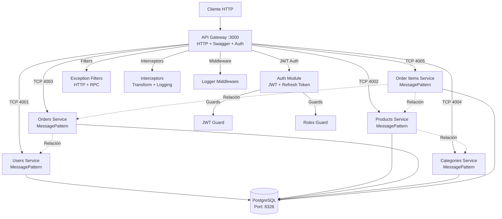

# Sportsline E-Commerce - Microservices Architecture

## 📋 Descripción del Proyecto

Sportsline E-Commerce es una aplicación de comercio electrónico construida con **NestJS** utilizando una **arquitectura de microservicios**. El proyecto está diseñado para ser escalable, mantenible y fácil de desplegar usando Docker.

## ✅ Requisitos Previos

Antes de iniciar el proyecto, asegúrate de tener instalado:

- **Node.js** v18 o superior
- **npm** v9 o superior
- **Docker Desktop** (Windows/Mac) o **Docker Engine + Docker Compose** (Linux)
- **Git**

## 🚀 Inicio Rápido (Desde Cero)

Sigue estos pasos para ejecutar el proyecto desde cero:

### 1. Clonar el repositorio
```bash
git clone <repository-url>
cd sportsline-ecommerce
```

### 2. Instalar dependencias
```bash
npm install
```

### 3. Configurar variables de entorno

Verifica que el archivo `.env` en la raíz del proyecto tenga la siguiente configuración:

```env
DATABASE_HOST=localhost
DATABASE_PORT=8326
DATABASE_USER=jeferson
DATABASE_PASSWORD=JefersonKainToph
DATABASE_NAME=sportsline
```

### 4. Iniciar el proyecto con Docker (Recomendado)

```bash
# Primera vez: Limpiar volúmenes previos (IMPORTANTE)
docker compose down -v

# Iniciar base de datos y todos los microservicios
docker compose up --build
```

O simplemente:

```bash
npm run docker
```

Este comando:
- ✅ Limpia contenedores previos
- ✅ Inicia PostgreSQL en el puerto 8326 con la nueva contraseña
- ✅ Espera a que la base de datos esté lista (health check automático)
- ✅ Inicia todos los microservicios
- ✅ Crea las tablas automáticamente (TypeORM synchronize)

### 5. Verificar que todo funcione

```bash
# Verificar estado de los contenedores
docker compose ps

# Ver logs de todos los servicios
docker compose logs -f
```

### 6. Acceder a las APIs

Una vez iniciado, puedes acceder a:

- **API Gateway**: http://localhost:3000 (punto de entrada HTTP único)
- **Swagger Documentation**: http://localhost:3000/docs (documentación interactiva de todas las rutas)
- **Microservices**: Puertos 4001-4005 (TCP, comunicación interna vía message patterns)
- **Database**: localhost:8326 (usuario: jeferson, password: JefersonKainToph)

### 7. Autenticación

El proyecto implementa autenticación JWT completa:

```bash
# Registrar un nuevo usuario
POST http://localhost:3000/auth/register
{
  "name": "John Doe",
  "email": "john@example.com",
  "password": "password123"
}

# Login
POST http://localhost:3000/auth/login
{
  "email": "john@example.com",
  "password": "password123"
}

# Respuesta incluye:
{
  "success": true,
  "data": {
    "accessToken": "eyJhbGciOiJIUzI1NiIsInR5cCI6IkpXVCJ9...",
    "refreshToken": "eyJhbGciOiJIUzI1NiIsInR5cCI6IkpXVCJ9...",
    "user": { "id": "...", "name": "...", "email": "...", "role": "user" }
  }
}

# Usar el token en peticiones protegidas
Authorization: Bearer <accessToken>

# Refrescar token
POST http://localhost:3000/auth/refresh
{
  "refreshToken": "<refreshToken>"
}

# Obtener perfil del usuario actual
GET http://localhost:3000/auth/profile
Authorization: Bearer <accessToken>
```

**Usuarios de prueba (seeders):**
- **Admin**: admin@sportsline.com / admin123 (rol: admin)
- **User**: user@sportsline.com / user123 (rol: user)

## 🏗️ Arquitectura de Microservicios

El proyecto está construido con una arquitectura API Gateway + Microservicios:



### Características Clave

- **API Gateway (Port 3000)**: Único punto de entrada HTTP. Toda la documentación Swagger está centralizada aquí.
- **Microservicios (Ports 4001-4005)**: Solo exponen comunicación TCP vía message patterns (no tienen endpoints HTTP).
- **Base de datos compartida**: Actualmente todos los servicios apuntan a la misma DB (fase de migración hacia separación completa).
- **Swagger centralizado**: `/docs` disponible únicamente en el gateway, documentando todos los endpoints públicos.
- **Autenticación JWT**: Sistema completo con Access Token + Refresh Token implementado en el gateway.
- **Guards Globales**: JwtAuthGuard y RolesGuard protegen todas las rutas excepto las marcadas como `@Public()`.
- **Middleware de Logging**: Registra todas las peticiones HTTP con métricas de rendimiento.
- **Exception Filters**: Manejo centralizado de errores HTTP y RPC.
- **Interceptors**: Transformación de respuestas y logging de operaciones.

### Flujo de Comunicación

```text
Cliente HTTP → Gateway :3000 → Microservicios TCP (4001-4005) → PostgreSQL :8326
                  ↓
              JWT Guards
              Role Guards
              Interceptors
              Filters
```

## 📁 Estructura del Proyecto

```
sportsline-ecommerce/
├── src/
│   ├── gateway/           # API Gateway (HTTP:3000)
│   │   ├── controllers/   # REST controllers organizados por módulo
│   │   ├── auth/         # Autenticación JWT + Refresh Token
│   │   ├── guards/       # JwtAuthGuard, RolesGuard
│   │   ├── decorators/   # @Public(), @Roles(), @CurrentUser()
│   │   ├── filters/      # HTTP & RPC exception filters
│   │   ├── interceptors/ # Transform & Logging interceptors
│   │   └── middleware/   # Logger middleware
│   │
│   ├── users/            # Microservicio TCP:4001
│   ├── products/         # Microservicio TCP:4002
│   ├── orders/           # Microservicio TCP:4003
│   ├── categories/       # Microservicio TCP:4004
│   ├── orderItems/       # Microservicio TCP:4005
│   │
│   └── libs/             # Módulos compartidos (database, seeder)
│
├── test/unit/            # Tests unitarios organizados
├── docker-compose.yml    # Orquestación completa
├── jest.config.js
├── package.json
├── README.md             # Guía de inicio rápido
└── IMPLEMENTATION.md     # Documentación técnica detallada
```

> 📘 **Para arquitectura detallada, ejemplos de código y guías de implementación**, consulta [IMPLEMENTATION.md](IMPLEMENTATION.md)

## 🔧 Variables de Entorno

Las variables clave ya están configuradas en `.env`:

```env
DATABASE_HOST=localhost
DATABASE_PORT=8326
DATABASE_USER=jeferson
DATABASE_PASSWORD=JefersonKainToph
DATABASE_NAME=sportsline

JWT_SECRET=your-secret-key-change-in-production
JWT_REFRESH_SECRET=your-refresh-secret-key-change-in-production
```

> ⚠️ **Producción**: Cambiar las claves JWT y credenciales de base de datos

## 🐳 Comandos Docker

### Iniciar todo el proyecto

```bash
# Iniciar servicios con Docker
npm run docker

# Detener servicios
npm run docker:down

# Limpiar todo (incluye volúmenes de BD)
npm run docker:clean

# Ver logs de todos los servicios
npm run docker:logs

# Ver logs de un servicio específico
docker compose logs -f users-service
docker compose logs -f postgres
```

### Conectarse a la base de datos

```bash
# Abrir psql en el contenedor
npm run db:psql

# O manualmente:
docker exec -it sportsline-ecommerce-postgres-1 psql -U jeferson -d sportsline
```

## 💻 Desarrollo Local (Sin Docker)

```bash
# Instalar dependencias
npm install

# Ejecutar todos los servicios en paralelo
npm run start:all

# O servicios individuales
npm run start:gateway     # Puerto 3000
npm run start:users       # Puerto 4001
npm run start:products    # Puerto 4002
# ...
```

> ⚠️ Requiere PostgreSQL en puerto 8326 con credenciales del `.env`

## 🧪 Testing

```bash
npm test              # Tests unitarios
npm run test:watch    # Watch mode
npm run test:cov      # Con cobertura
npm run test:e2e      # End-to-end
```

Tests organizados en `test/unit/` por módulo con mocks completos.

## 📊 Acceso a la Base de Datos

La base de datos PostgreSQL está expuesta en el puerto **8326**:

```bash
# Conectar usando psql (desde tu máquina local)
psql -h localhost -p 8326 -U jeferson -d sportsline

# Conectar desde el contenedor
docker exec -it sportsline-ecommerce-postgres-1 psql -U jeferson -d sportsline

# Credenciales
Host: localhost
Port: 8326
User: jeferson
Password: JefersonKainToph
Database: sportsline
```

## 📚 Documentación API (Swagger)

**Swagger UI**: <http://localhost:3000/docs>

Documentación centralizada de todos los microservicios con soporte para autenticación JWT.

### Autenticación en Swagger

1. Login/Register → Copiar `accessToken`
2. Click **Authorize** → Ingresar `Bearer <token>`
3. Probar endpoints protegidos

> 📘 **Endpoints detallados y ejemplos** en [IMPLEMENTATION.md](IMPLEMENTATION.md)

## 🔧 Comandos Útiles

```bash
# Docker
npm run docker              # Iniciar con Docker
npm run docker:down         # Detener servicios
npm run docker:clean        # Limpiar todo (incluye volúmenes)
npm run docker:logs         # Ver logs

# Base de datos
npm run db:psql             # Conectar a PostgreSQL
npm run db:logs             # Ver logs de la base de datos
npm run seed                # Ejecutar seeders

# Desarrollo local
npm run start               # Gateway en modo watch
npm run start:all           # Todos los servicios en paralelo
npm run start:debug         # Gateway con debugger

# Build
npm run build               # Compilar todo
npm run build:gateway       # Compilar solo gateway

# Tests
npm run test                # Tests unitarios
npm run test:watch          # Tests en modo watch
npm run test:cov            # Tests con coverage
npm run test:e2e            # Tests end-to-end

# Code quality
npm run lint                # Ejecutar ESLint
npm run format              # Formatear código con Prettier
```

## 🌟 Características Principales

### Arquitectura
- ✅ **Arquitectura de Microservicios**: Servicios independientes y escalables con comunicación TCP
- ✅ **API Gateway Pattern**: Único punto de entrada HTTP con enrutamiento a microservicios
- ✅ **NestJS Monorepo**: Gestión centralizada de múltiples servicios

### Persistencia
- ✅ **TypeORM**: ORM con soporte para entidades, relaciones y migraciones
- ✅ **PostgreSQL**: Base de datos relacional robusta
- ✅ **Seeders**: Datos de prueba iniciales (categorías, productos, usuarios, órdenes)

### Seguridad y Autenticación
- ✅ **JWT Authentication**: Sistema completo con Access Token (15 min) y Refresh Token (7 días)
- ✅ **Password Hashing**: Bcryptjs para encriptación segura de contraseñas
- ✅ **Role-Based Access Control (RBAC)**: Roles de usuario (admin, user) desde base de datos
- ✅ **Guards Globales**: JwtAuthGuard y RolesGuard protegiendo todas las rutas
- ✅ **Decoradores Personalizados**: @Public(), @Roles(), @CurrentUser()

### Middleware y Filtros
- ✅ **Logger Middleware**: Registro de todas las peticiones HTTP con métricas de rendimiento
- ✅ **Exception Filters**: Manejo centralizado de errores HTTP y RPC
- ✅ **Transform Interceptor**: Formato consistente de respuestas
- ✅ **Logging Interceptor**: Métricas de tiempo de ejecución

### Documentación y Testing
- ✅ **Swagger/OpenAPI**: Documentación interactiva centralizada en `/docs`
- ✅ **Tests Unitarios**: Suite completa con Jest y cobertura
- ✅ **DTOs con Validación**: class-validator y class-transformer
- ✅ **TypeScript Strict**: Tipado fuerte en todo el proyecto

### DevOps
- ✅ **Docker Compose**: Orquestación completa de servicios
- ✅ **Hot Reload**: Desarrollo ágil con recarga automática
- ✅ **Health Checks**: Verificación automática de servicios
- ✅ **Scripts NPM**: Comandos organizados para desarrollo, build, test y docker

## 🔐 Seguridad

> [!IMPORTANT]
> Las credenciales mostradas en este README son **solo para desarrollo**. En producción, utiliza variables de entorno seguras y nunca expongas credenciales en el código.

## 📝 Notas Importantes

### Puertos
- **Gateway**: 3000 (HTTP/REST)
- **Microservicios**: 4001-4005 (TCP)
- **Database**: 8326 (PostgreSQL)

### Seguridad
- **JWT Tokens**: Access (15m) + Refresh (7d)
- **Guards Globales**: Rutas protegidas por defecto
- **Decorador @Public()**: Para endpoints públicos
- **Password Hashing**: Bcryptjs (salt rounds: 10)

### Desarrollo
- **Hot Reload**: Activado en modo desarrollo
- **TypeORM Sync**: `true` (desarrollo), usar migraciones en producción
- **CORS**: Habilitado en gateway
- **Validation**: Global con class-validator

> 📘 **Documentación técnica completa**: [IMPLEMENTATION.md](IMPLEMENTATION.md)  
> - Arquitectura detallada y patrones de diseño  
> - Guías de implementación paso a paso  
> - Ejemplos de código y configuración  
> - Historias de usuario implementadas

## 🤝 Contribución

1. Fork el proyecto
2. Crea una rama para tu feature (`git checkout -b feature/AmazingFeature`)
3. Commit tus cambios (`git commit -m 'Add some AmazingFeature'`)
4. Push a la rama (`git push origin feature/AmazingFeature`)
5. Abre un Pull Request

## 📄 Licencia

Este proyecto está bajo la licencia MIT.

---

**Desarrollado con ❤️ usando NestJS y Docker**